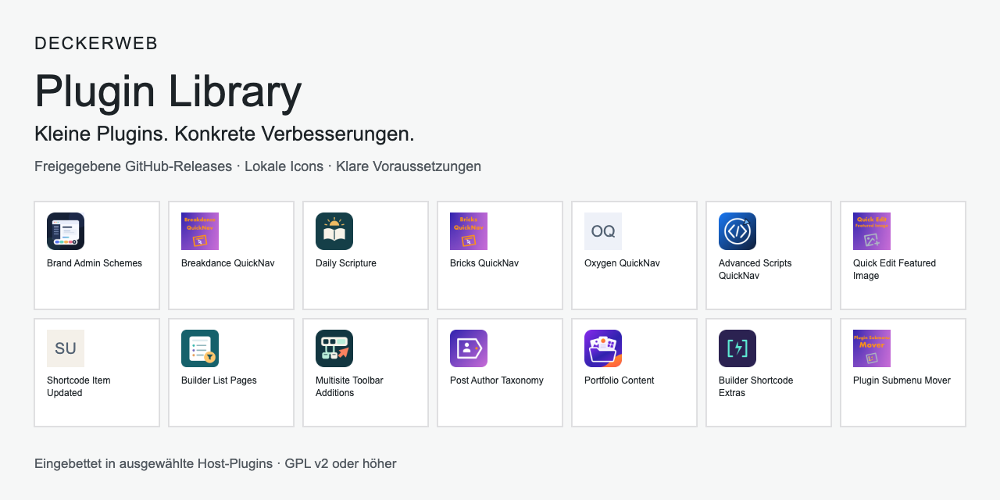

# deckerweb Plugin Library

[English](README.md)

## Über die Library

Ein kleiner eingebetteter Katalog für direkt vertriebene WordPress-Plugins. Unter Plugins → Plugin hinzufügen → deckerweb erscheinen nur ausdrücklich freigegebene GitHub-Releases. Dies ist ein Einbindungspaket, kein separat installierbares Plugin.

Anforderungen: WordPress 6.4+, PHP 8.0+, ZipArchive für Installation. GPL-2.0-or-later. Nur Direktvertrieb; Library und deckerweb Updater vollständig aus WordPress.org-Builds ausschließen.

**Version:** 0.6.0 · WordPress ≥ 6.4 · PHP ≥ 8.0

[Dokumentation](docs/INTEGRATION-de.md) · [Fragen nach Themen](docs/FAQ-de.md) · [Sicherheit](SECURITY-de.md)

## Inhalt

- [Auf einen Blick](#at-a-glance)
- [Einbindung](#installation)
- [Funktionen](#features)
- [FAQ](#faq)
- [Changelog](#changelog)
- [Autor und Umfang](#author)
- [Unterstützung](#support)

## Auf einen Blick

- Ausgewählte öffentliche GitHub-Releases mit lokalen Icons und klaren Voraussetzungen.
- Suche, Serienfilter und passende Voraussetzungen.
- Optionaler täglicher Online-Katalog; unabhängige Updateprüfungen installierter Plugins.

## Einbindung und erste Schritte

Siehe [integration](docs/INTEGRATION-de.md), [data](docs/DATA-de.md), [tests](docs/TESTING-de.md) und [security](SECURITY-de.md).

[Serien und Filter](docs/SERIES-de.md).

## Hauptfunktionen

### Passende Plugins finden

Den deckerweb-Tab unter Plugins → Installieren öffnen. Suche, QuickNav/Builder/Purify/Manage Content und „Passt zu meiner Installation“ kombinieren. Jede Karte erklärt fehlende Voraussetzungen; Installation und Aktivierung bleiben getrennt.

### Freigegebene Katalogupdates

Die öffentliche GitHub-Katalogadresse ist vorausgefüllt. Online-Abfragen in den Library-Einstellungen aktivieren. Die Anzeige wird 24 Stunden gespeichert. Freigegebene Plugin-Releases können sich ohne Austausch des Library-Codes ändern. [Kataloganleitung](docs/CATALOG-de.md).

### Gemeinsame Einstellungen und sichere Pakete

Installierte Hosts teilen Einstellungen; Deaktivieren erhält Daten. Frische Freigabe, Prüfsummen und Archivprüfung schützen Paketaktionen. [Daten](docs/DATA-de.md) · [Updater-Einbindung](docs/UPDATER-de.md).

## FAQ

### Wo ist der Katalog?

Plugins → Plugin hinzufügen → deckerweb öffnen. WordPress.org bleibt die Standardansicht.

### Werden externe Dienste kontaktiert?

Die lokale Ansicht nicht. Installation lädt das ausgewählte GitHub-Release. Optionale Online-Freigaben kontaktieren die konfigurierte eigene HTTPS-Quelle; deren Server sieht die anfragende IP-Adresse. Website-URL, Nutzer-ID, Plugin-Inventar und Telemetrie werden nicht übertragen.

### Warum ist eine Installation nicht verfügbar?

Die Karte zeigt fehlende oder inaktive Abhängigkeiten sowie WordPress-/PHP-Anforderungen. Voraussetzungen werden nicht automatisch installiert; Aktivierung ist ein eigener Schritt.

### Kann der Katalog ausgeblendet werden?

Unter Einstellungen → deckerweb Library (bei Multisite in den Netzwerkeinstellungen). Ausblenden erhält Abhängigkeitsprüfungen und bereits eingerichtete Updates. Online-Abrufe separat abschalten.

### Was passiert beim Entfernen eines Hosts?

Ein weiterer installierter Host erhält gemeinsam genutzte Daten, auch deaktiviert. Der letzte Host bereinigt temporäre Library-Daten und Caches. Einstellungen bleiben ohne ausdrücklich aktivierte Löschoption erhalten. Installierte Plugins und Inhalte bleiben bestehen. Hosts müssen den mitgelieferten Uninstall-Vertrag aufrufen.

### Wird Multisite unterstützt?

Library-Einstellungen gelten je Netzwerk, der Einführungshinweis je Nutzer. Netzwerkaktionen erfordern passende Berechtigungen und Abhängigkeiten. Bricks QuickNav behält bis zur separaten Host-Anpassung seine Website-Beschränkung; Daily folgt den veröffentlichten Release-Regeln.

### Wie wird eine Sicherheitslücke gemeldet?

Im Host-Plugin-Repository Security → Advisories → Report a vulnerability verwenden. Host- und Library-Version nennen; Sicherheitsdetails nicht in öffentlichen Issues posten. Hosts müssen den privaten Meldeweg vor Veröffentlichung aktivieren.

[Vollständige Fragen nach Themen](docs/FAQ-de.md).

## Änderungsverlauf

### 0.6.0 · 2026-10-06

- **Neu:** Freigegebene Plugin-Releases können im Online-Katalog erscheinen, ohne die eingebettete Library auszutauschen.
- **Neu:** Purify WPCode Lite und Purify WPForms Lite im Katalog entdecken.
- **Neu:** Plugins können mehreren Serien angehören, darunter Inhalte verwalten.
- **Verbessert:** Der Katalog wird nach 24 Stunden aktualisiert; Updateprüfungen installierter Plugins nutzen einen unabhängigen Cache.
- **Verbessert:** Die optionale Anbindung des Host-Updaters erhält aktuelle Paketfreigaben und Prüfsummenprüfungen.
- **Verbessert:** Die öffentliche GitHub-Katalogadresse ist in den Library-Einstellungen vorausgefüllt.
- **Behoben:** Katalog- und Paketabfragen verwenden eine Clientkennung ohne Website-URL.
- **Behoben:** Plugins mit eigenem Updater bleiben bei nicht erreichbarem Katalog unabhängig.
- **Behoben:** Online-Katalogquellen sind auf den GitHub-Raw-Dateihost von deckerweb beschränkt.

### 0.5.0 · 2026-10-05

- **Neu:** Ausdrückliche Serienzuordnung für QuickNav, Builder und Purify, dezente Karten-Badges und Serienfilter. Leere Serien bleiben verborgen.
- **Neu:** Purify Elementor ergänzt den freigegebenen Katalog und die Purify-Serie; Multisite Toolbar Additions gehört zu QuickNav.
- **Verbessert:** Serien und Suche mit „Passt zu meiner Installation“ kombinieren; Filter ohne Einstellungsänderung zurücksetzen.

### 0.4.0 · 2026-10-05

- **Neu:** Übersetzungen über die Host-Textdomain auf Englisch, Deutsch (Du) und Deutsch (Sie).
- **Neu:** Gemeinsame Bereinigung beim letzten Host mit optionaler Einstellungslöschung und lokalem zugänglichem Änderungsverlauf.
- **Verbessert:** Kompatible Laufzeitwahl mit alten und neuen Hosts; aktuelle freigegebene Katalogquellen und lokale Icons.
- **Behoben:** Übergroße Archivinhalte vor dem Lesen ablehnen und Dateien über begrenzte Streams aufbereiten.
- **Behoben:** Host-Code bei Integration erhalten und Plattformkonflikte ohne Erhöhung der Mindestversionen melden.
- **Sonstiges:** Zweisprachige Dokumentation, private Sicherheitsmeldungen über Host-Repositories und dokumentierte Datenzuordnung.

### 0.3.0 · 2026-10-01

- **Neu:** Vierzehn freigegebene Plugins, zwölf lokale Original-Icons und datierte GitHub-Sterne.
- **Verbessert:** Explizite Multisite-Anforderungen und aktualisierte Release-Quellen.

### 0.2.0

- **Neu:** Zusätzliche Katalogeinträge, lokale Produkt-Icons und GitHub-Sterne als Zahlenstand.

### 0.1.0

- **Neu:** Eingebetteter kuratierter Katalog, geprüfte Installation, separate Aktivierung und optionale Online-Freigaben.

## Autor und Umfang

Entwickelt und herausgegeben von David Decker — DECKERWEB. Gemeinsame eingebettete Komponente für direkt vertriebene Plugins, kein eigenständiges WordPress.org-Plugin.

## Fragen, Sicherheit und Unterstützung

Normale Fehler und Fragen im Repository des einbettenden Hosts melden; Sicherheitsdetails über dessen privaten Meldeweg. [Sicherheitsrichtlinie](SECURITY-de.md).

[Ko-fi](https://ko-fi.com/deckerweb) · [Buy Me a Coffee](https://buymeacoffee.com/daveshine) · [PayPal](https://paypal.me/deckerweb)

## Copyright und Lizenzen

Copyright © 2026 David Decker — DECKERWEB. GPL-2.0-or-later. [Lizenz](LICENSE) · [Grafiken und Herkunft](docs/ASSETS-de.md).
