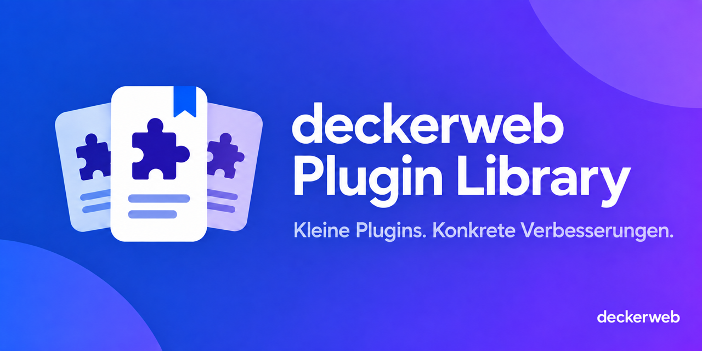
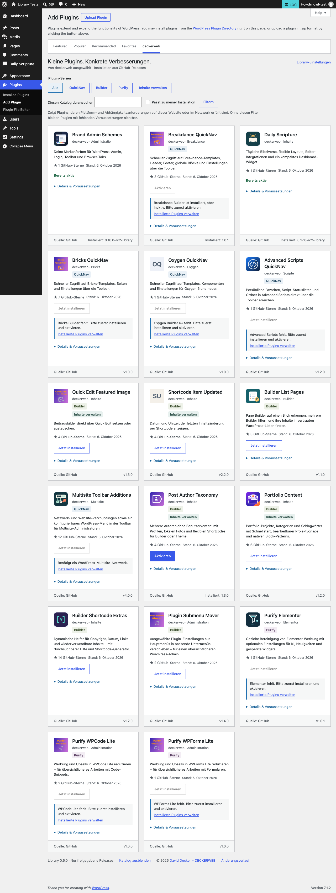

# deckerweb Plugin Library

[English](README.md)



## Über die Library

Die deckerweb Plugin Library ergänzt WordPress um einen ausgewählten Katalog von deckerweb Plugins. Sie wird mit bestimmten Plugins mitgeliefert und bietet dir unter **Plugins → Plugin hinzufügen → deckerweb** eine weitere Möglichkeit, hilfreiche Erweiterungen zu entdecken und zu installieren. Der gewohnte WordPress.org-Katalog bleibt die Standardansicht.

Wenn du in einem Plugin den Ordner `includes/deckerweb-plugin-library/` entdeckt hast: Dort liegt die gemeinsame Komponente hinter diesem Katalog. Der Plugin-Autor hat sie bewusst eingebunden. Du musst dafür kein zusätzliches Library-Plugin installieren oder einrichten.

Dieses Repository enthält die wiederverwendbare PHP-Komponente, den Katalog, Einbindungsbeispiele und Dokumentation. Entwickler können den Code durchstöbern, unter seiner Lizenz weiterverwenden oder als Anregung für eine eigene Lösung nutzen.

**Version:** 0.6.1 · WordPress ≥ 6.4 · PHP ≥ 8.0

[Dokumentation](docs/INTEGRATION-de.md) · [Fragen nach Themen](docs/FAQ-de.md) · [Sicherheit](SECURITY-de.md)

## Inhalt

- [Auf einen Blick](#at-a-glance)
- [Einbindung](#installation)
- [Funktionen](#features)
- [Für Plugin-Nutzer](#for-users)
- [Für Entwickler](#for-developers)
- [FAQ](#faq)
- [Changelog](#changelog)
- [Autor und Umfang](#author)
- [Unterstützung](#support)

<a id="at-a-glance"></a>
## Auf einen Blick

- Ausgewählte öffentliche GitHub-Releases mit lokalen Icons und klaren Voraussetzungen.
- Suche, Serienfilter und passende Voraussetzungen.
- Optionaler täglicher Online-Katalog; unabhängige Updateprüfungen installierter Plugins.

<a id="installation"></a>
## Einbindung und erste Schritte

Siehe [integration](docs/INTEGRATION-de.md), [data](docs/DATA-de.md), [tests](docs/TESTING-de.md) und [security](SECURITY-de.md).

[Serien und Filter](docs/SERIES-de.md).

<a id="features"></a>
## Hauptfunktionen

### Passende Plugins finden

Den deckerweb-Tab unter Plugins → Installieren öffnen. Suche, QuickNav/Builder/Purify/Manage Content/Connect und „Passt zu meiner Installation“ kombinieren. Jede Karte erklärt fehlende Voraussetzungen; Installation und Aktivierung bleiben getrennt.

### Freigegebene Katalogupdates

Die öffentliche GitHub-Katalogadresse ist vorausgefüllt. Online-Abfragen in den Library-Einstellungen aktivieren. Die Anzeige wird 24 Stunden gespeichert. Freigegebene Plugin-Releases können sich ohne Austausch des Library-Codes ändern. [Kataloganleitung](docs/CATALOG-de.md).

### Gemeinsame Einstellungen und sichere Pakete

Installierte Hosts teilen Einstellungen; Deaktivieren erhält Daten. Frische Freigabe, Prüfsummen und Archivprüfung schützen Paketaktionen. [Daten](docs/DATA-de.md) · [Updater-Einbindung](docs/UPDATER-de.md).

### Ein Blick in den Katalog


Dieser bisherige Überblick veranschaulicht den Katalog mit beispielhaften Plugins und ihren Icons. Er ist eine schematische Darstellung, kein Screenshot und keine vollständige Liste des heutigen Katalogs. Verfügbare Releases und Voraussetzungen stehen auf den tatsächlichen Plugin-Karten.

### Der Katalog in WordPress



Ein realer Screenshot aus einer Testinstallation mit Library 0.6.0. Er zeigt Plugin-Karten, Filter, Installationsaktionen und Hinweise auf Abhängigkeiten. Katalog und angezeigte Versionen können sich ändern; das Bild ist ein Beispiel, keine laufend aktuelle Release-Liste.

<a id="for-users"></a>
## Die Library in deinem Plugin entdeckt?

### Du entscheidest, was installiert wird

Der Katalog zeigt ausgewählte öffentliche GitHub-Releases, ihre Voraussetzungen und fehlende Abhängigkeiten. Das Öffnen einer Karte installiert nichts. Du startest die Installation selbst; die Aktivierung ist ein eigener Schritt. Benötigte Drittanbieter-Plugins werden nicht automatisch installiert.

Unter **Einstellungen → deckerweb Library** beziehungsweise in den Netzwerkeinstellungen einer Multisite kannst du den Katalog ausblenden. Bereits eingerichtete Updates bleiben dabei erhalten. Enthalten mehrere installierte Plugins die Library, teilen sie einen Katalog und seine Einstellungen, statt die Oberfläche mehrfach anzulegen.

### Externe Verbindungen sind nachvollziehbar

Der mitgelieferte Katalog und seine Icons lassen sich lokal anzeigen. Der optionale Online-Katalog ist **standardmäßig ausgeschaltet**. Wenn du ihn aktivierst, liest die Library den öffentlichen Katalog von GitHub und speichert die Anzeige 24 Stunden zwischen. Du kannst ihn auch manuell aktualisieren. Eine Plugin-Installation lädt das ausgewählte, freigegebene GitHub-ZIP. Paketaktionen im Online-Modus prüfen die Freigabe nochmals frisch.

Der jeweilige Server sieht dabei die anfragende IP-Adresse. Die Library überträgt weder deine Website-URL noch Nutzer-ID oder Plugin-Inventar und enthält keine Telemetrie. Bestehende Plugin-Updater können eigene Verbindungen aufbauen; dazu gilt die Dokumentation des einbettenden Plugins. Für den öffentlichen Katalog und öffentliche Paketdownloads brauchst du keinen GitHub-Account oder Nutzer-Token.

### Prüfungen vor der Installation

Die Library prüft WordPress-/PHP-Anforderungen, angegebene Abhängigkeiten, Paketidentität, Prüfsumme und Archivstruktur. Das hilft, unerwartete Pakete zurückzuweisen, garantiert aber nicht, dass jedes Plugin zu jeder Website passt. Lies die jeweilige Plugin-Dokumentation und nutze deinen gewohnten Backup- und Testablauf.

Das Deaktivieren eines einbettenden Plugins erhält gemeinsame Library-Einstellungen. Richtig eingebundene Plugins bereinigen temporäre Library-Daten bei der Deinstallation des letzten Hosts; das Löschen der Einstellungen ist optional. Über den Katalog installierte Plugins und deren Inhalte bleiben erhalten. Siehe [Datenhaltung und Bereinigung](docs/DATA-de.md).

<a id="for-developers"></a>
## Für Entwickler: durchstöbern, nutzen, anpassen

Die Library steht unter **GPL-2.0-or-later**. Du kannst den Code unter dieser Lizenz studieren, weiterverwenden und anpassen. Erhalte Copyright- und erforderliche Herkunftshinweise. Prüfe vor der Übernahme von Grafiken oder Branding die gesonderten [Grafikhinweise](docs/ASSETS-de.md).

### Mit dem Einbindungsvertrag starten

Die Komponente benötigt **WordPress 6.4+ und PHP 8.0+**, für Paketinstallationen außerdem **ZipArchive**. Ein Host-Plugin oder Katalogeintrag kann höhere Anforderungen haben. Kopiere nur `lib/` nach `includes/deckerweb-plugin-library/` im Host und registriere die Library vor `plugins_loaded`:

```php
require_once __DIR__ . '/includes/deckerweb-plugin-library/bootstrap.php';
deckerweb_library_register_v2(
    __FILE__,
    [],
    __DIR__ . '/includes/deckerweb-plugin-library'
);
```

Das ist der Einstieg, nicht die gesamte Einbindung. Die [Integrationsanleitung](docs/INTEGRATION-de.md) beschreibt den erforderlichen Uninstall-Vertrag, Übersetzungen über die Host-Textdomain und Prüfungen mit mehreren Kopien. Erhalte den eigenen Updater des Hosts; die [Kataloganbindung](docs/UPDATER-de.md) ist optional. Liefere die Laufzeitdateien aus, nicht die Entwicklungswerkzeuge oder das gesamte Repository. Die aktuelle Library und der deckerweb Updater bleiben aus WordPress.org-Builds ausgeschlossen; dieses Kit ist für Direktvertrieb vorgesehen.

### Ein sinnvoller Weg durch den Code

- [`lib/bootstrap.php`](lib/bootstrap.php): Registrierung und Auswahl einer kompatiblen gemeinsamen Laufzeit.
- [`lib/src/Catalog.php`](lib/src/Catalog.php): Katalogvalidierung, erlaubte Quellen und unabhängige Caches.
- [`lib/src/Requirements.php`](lib/src/Requirements.php) und [`lib/src/Package.php`](lib/src/Package.php): Voraussetzungen, Paketprüfung und begrenzte Archivverarbeitung.
- [`lib/lifecycle.php`](lib/lifecycle.php): gemeinsame Datenhaltung und Bereinigung nach dem letzten Host.
- [`tools/refresh-catalog.py`](tools/refresh-catalog.py) und [`tools/approve-catalog.py`](tools/approve-catalog.py): Kandidat erstellen, prüfen und exakt freigegebene Daten exportieren. Die Veröffentlichung bleibt eine separate Betreiberaktion.

### Einen eigenen Katalog bauen

Die ausgelieferte Implementierung ist bewusst auf freigegebene deckerweb Repositories und Katalogquellen beschränkt. Eine beliebige JSON-URL einzutragen reicht für einen anderen Herausgeber nicht aus. Passe erlaubte Quellen, Repository-Identitäten, Paketregeln, Serien, Übersetzungen und gemeinsame Laufzeitverwaltung gezielt an und teste sie. Vermeide Namespace- und Bootstrap-Kollisionen, wenn deine Variante neben deckerweb Plugins laufen kann.

Trenne Katalogmetadaten von Komponenten-Releases, speichere die Anzeige zwischen und frage GitHub nicht bei jedem Seitenaufruf ab. Prüfe Paketfreigaben vor entsprechenden Aktionen frisch und erhalte unabhängige Host-Updatewege. Siehe [Kataloganleitung](docs/CATALOG-de.md), [Testanleitung](docs/TESTING-de.md) und [Release-Konventionen](docs/CONVENTIONS-de.md). Ideen und Implementierungsfragen sind in den Issues und Discussions dieses Repositories willkommen; private Sicherheitsmeldungen zu einer eingebetteten Kopie gehören in das Repository ihres Host-Plugins.


## FAQ

### Wo ist der Katalog?

Plugins → Plugin hinzufügen → deckerweb öffnen. WordPress.org bleibt die Standardansicht.

### Werden externe Dienste kontaktiert?

Die lokale Ansicht nicht. Installation lädt das ausgewählte GitHub-Release. Optionale Online-Freigaben kontaktieren die konfigurierte eigene HTTPS-Quelle; deren Server sieht die anfragende IP-Adresse. Website-URL, Nutzer-ID, Plugin-Inventar und Telemetrie werden nicht übertragen.

### Warum ist eine Installation nicht verfügbar?

Die Karte zeigt fehlende oder inaktive Abhängigkeiten sowie WordPress-/PHP-Anforderungen. Voraussetzungen werden nicht automatisch installiert; Aktivierung ist ein eigener Schritt.

### Kann der Katalog ausgeblendet werden?

Unter Einstellungen → deckerweb Library (bei Multisite in den Netzwerkeinstellungen). Ausblenden erhält Abhängigkeitsprüfungen und bereits eingerichtete Updates. Online-Abrufe separat abschalten.

### Was passiert beim Entfernen eines Hosts?

Ein weiterer installierter Host erhält gemeinsam genutzte Daten, auch deaktiviert. Der letzte Host bereinigt temporäre Library-Daten und Caches. Einstellungen bleiben ohne ausdrücklich aktivierte Löschoption erhalten. Installierte Plugins und Inhalte bleiben bestehen. Hosts müssen den mitgelieferten Uninstall-Vertrag aufrufen.

### Wird Multisite unterstützt?

Library-Einstellungen gelten je Netzwerk. Daily Scripture ab 1.0.0 unterstützt Netzwerkaktivierung; ältere installierte Versionen müssen zuvor aktualisiert werden. Bricks QuickNav bleibt auf Website-Aktivierung beschränkt. Berechtigungs- und Abhängigkeitsprüfungen gelten weiterhin.

### Wie wird eine Sicherheitslücke gemeldet?

Im Host-Plugin-Repository Security → Advisories → Report a vulnerability verwenden. Host- und Library-Version nennen; Sicherheitsdetails nicht in öffentlichen Issues posten. Hosts müssen den privaten Meldeweg vor Veröffentlichung aktivieren.

[Vollständige Fragen nach Themen](docs/FAQ-de.md).

<a id="changelog"></a>
## Änderungsverlauf

### 0.6.1 · 2026-10-07

- **Verbessert:** Freigegebene Plugin-Releases und originale Katalogicons aktualisiert.
- **Verbessert:** Der Einstellungs-Footer zeigt das lokale SVG-Icon, den Namen und die Version der Library.
- **Behoben:** Daily Scripture ab 1.0.0 kann auch neben einer älteren eingebetteten Library netzwerkweit aktiviert werden.
- **Behoben:** Einzelne gefilterte Treffer behalten auf breiten Ansichten die normale Kartenbreite.
- **Behoben:** Multisite Toolbar Additions wird auch für einzelne Websites und Website-Aktivierung angeboten.

### 0.6.0 · 2026-10-06

- **Neu:** Freigegebene Plugin-Releases können im Online-Katalog erscheinen, ohne die eingebettete Library auszutauschen.
- **Neu:** Purify WPCode Lite und Purify WPForms Lite im Katalog entdecken.
- **Neu:** Plugins können mehreren Serien angehören, darunter Inhalte verwalten.
- **Neu:** Die Connect-Serie und das kommende Connect for Shopware 1.0.0 mit klarem Vorbereitungshinweis entdecken.
- **Verbessert:** Der Katalog wird nach 24 Stunden aktualisiert; Updateprüfungen installierter Plugins nutzen einen unabhängigen Cache.
- **Verbessert:** Die optionale Anbindung des Host-Updaters erhält aktuelle Paketfreigaben und Prüfsummenprüfungen.
- **Verbessert:** Die öffentliche GitHub-Katalogadresse ist in den Library-Einstellungen vorausgefüllt.
- **Behoben:** Katalog- und Paketabfragen verwenden eine Clientkennung ohne Website-URL.
- **Behoben:** Plugins mit eigenem Updater bleiben bei nicht erreichbarem Katalog unabhängig.
- **Behoben:** Online-Katalogquellen sind auf den GitHub-Raw-Dateihost von deckerweb beschränkt.

### 0.5.0 · 2026-10-05

- **Neu:** Ausdrückliche Serienzuordnung für QuickNav, Builder und Purify, dezente Karten-Badges und Serienfilter. Leere Serien bleiben verborgen.
- **Neu:** Purify Elementor ergänzt den freigegebenen Katalog und die Purify-Serie; Multisite Toolbar Additions gehört zu QuickNav.
- **Verbessert:** Serien und Suche mit „Passt zu meiner Installation“ kombinieren; Filter ohne Einstellungsänderung zurücksetzen.

### 0.4.0 · 2026-10-05

- **Neu:** Übersetzungen über die Host-Textdomain auf Englisch, Deutsch (Du) und Deutsch (Sie).
- **Neu:** Gemeinsame Bereinigung beim letzten Host mit optionaler Einstellungslöschung und lokalem zugänglichem Änderungsverlauf.
- **Verbessert:** Kompatible Laufzeitwahl mit alten und neuen Hosts; aktuelle freigegebene Katalogquellen und lokale Icons.
- **Behoben:** Übergroße Archivinhalte vor dem Lesen ablehnen und Dateien über begrenzte Streams aufbereiten.
- **Behoben:** Host-Code bei Integration erhalten und Plattformkonflikte ohne Erhöhung der Mindestversionen melden.
- **Sonstiges:** Zweisprachige Dokumentation, private Sicherheitsmeldungen über Host-Repositories und dokumentierte Datenzuordnung.

### 0.3.0 · 2026-10-01

- **Neu:** Vierzehn freigegebene Plugins, zwölf lokale Original-Icons und datierte GitHub-Sterne.
- **Verbessert:** Explizite Multisite-Anforderungen und aktualisierte Release-Quellen.

### 0.2.0

- **Neu:** Zusätzliche Katalogeinträge, lokale Produkt-Icons und GitHub-Sterne als Zahlenstand.

### 0.1.0

- **Neu:** Eingebetteter kuratierter Katalog, geprüfte Installation, separate Aktivierung und optionale Online-Freigaben.

<a id="author"></a>
## Autor und Umfang

Entwickelt und herausgegeben von David Decker — DECKERWEB. Gemeinsame eingebettete Komponente für direkt vertriebene Plugins, kein eigenständiges WordPress.org-Plugin.

<a id="support"></a>
## Fragen, Sicherheit und Unterstützung

Normale Fehler und Fragen im Repository des einbettenden Hosts melden; Sicherheitsdetails über dessen privaten Meldeweg. [Sicherheitsrichtlinie](SECURITY-de.md).

[Ko-fi](https://ko-fi.com/deckerweb) · [Buy Me a Coffee](https://buymeacoffee.com/daveshine) · [PayPal](https://paypal.me/deckerweb)

## Copyright und Lizenzen

Copyright © 2026 David Decker — DECKERWEB. GPL-2.0-or-later. [Lizenz](LICENSE) · [Grafiken und Herkunft](docs/ASSETS-de.md).
