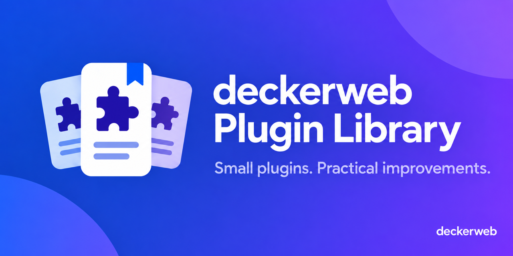

# deckerweb Plugin Library

A shared catalog that comes bundled with selected WordPress plugins. Discover useful additions while keeping control of installation and activation.

Ein gemeinsamer Katalog, der mit ausgewählten WordPress-Plugins mitgeliefert wird. Entdecke hilfreiche Ergänzungen und entscheide selbst über Installation und Aktivierung.

## Read more · Mehr erfahren

- [English introduction and developer entry point](https://github.com/deckerweb/deckerweb-plugin-library/wiki/README)
- [Deutsche Einführung und Einstieg für Entwickler](https://github.com/deckerweb/deckerweb-plugin-library/wiki/README-de)
- [Wiki](https://github.com/deckerweb/deckerweb-plugin-library/wiki)
- [Library 0.6.1](https://github.com/deckerweb/deckerweb-plugin-library/releases/tag/v0.6.1)

## Catalog at a glance · Katalog auf einen Blick

Illustrative overview; available releases can change. / Beispielübersicht; verfügbare Releases können sich ändern.

## Support · Unterstützung

[Ko-fi](https://ko-fi.com/deckerweb) · [Buy Me a Coffee](https://buymeacoffee.com/daveshine) · [PayPal](https://paypal.me/deckerweb)
