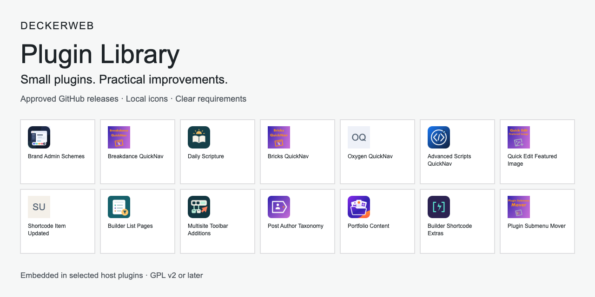

# deckerweb Plugin Library

[Deutsch](Home-de)

A small embedded catalog for directly distributed WordPress plugins. Only explicitly approved GitHub releases appear under Plugins → Add New → deckerweb. This is an embedding kit, not a standalone installable plugin.

Requirements: WordPress 6.4+, PHP 8.0+, ZipArchive for installation. GPL-2.0-or-later. Only direct-distribution builds; exclude Library and deckerweb Updater entirely from WordPress.org builds.

Small plugins. Practical improvements.

- [INTEGRATION](INTEGRATION)
- [SERIES](SERIES)
- [CATALOG](CATALOG)
- [FAQ](FAQ)
- [DATA](DATA)
- [UPDATER](UPDATER)
- [CHANGELOG](CHANGELOG)
- [TESTING](TESTING)
- [SECURITY](SECURITY)
